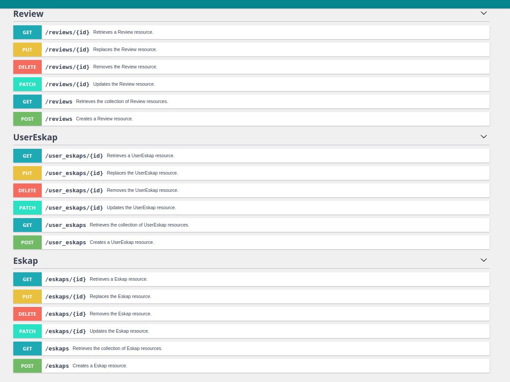
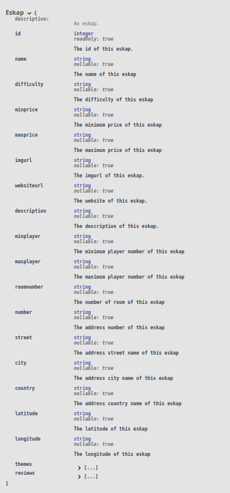
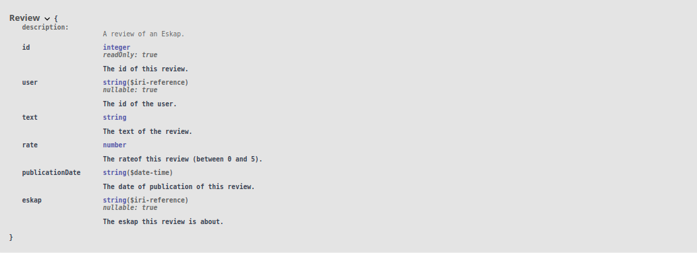
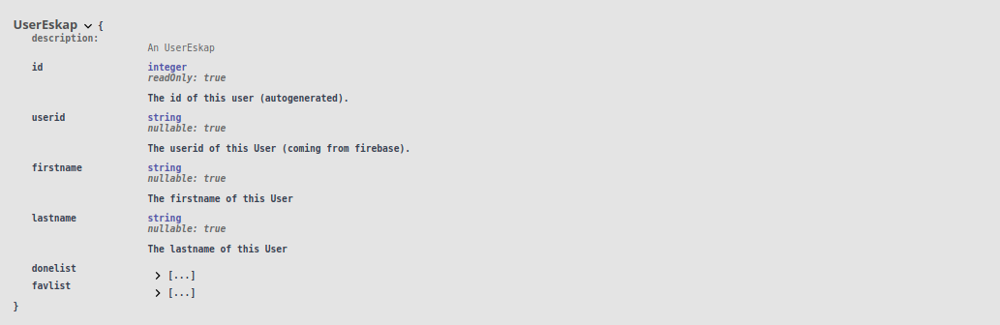
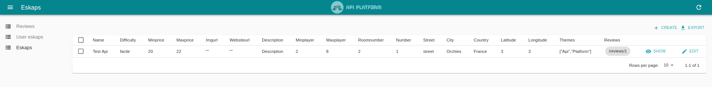
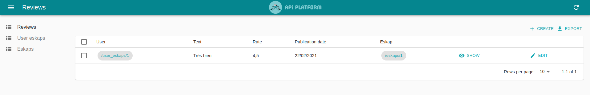
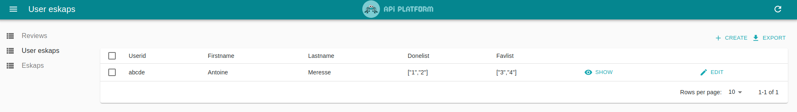
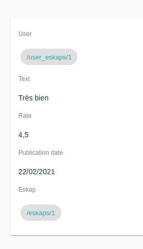
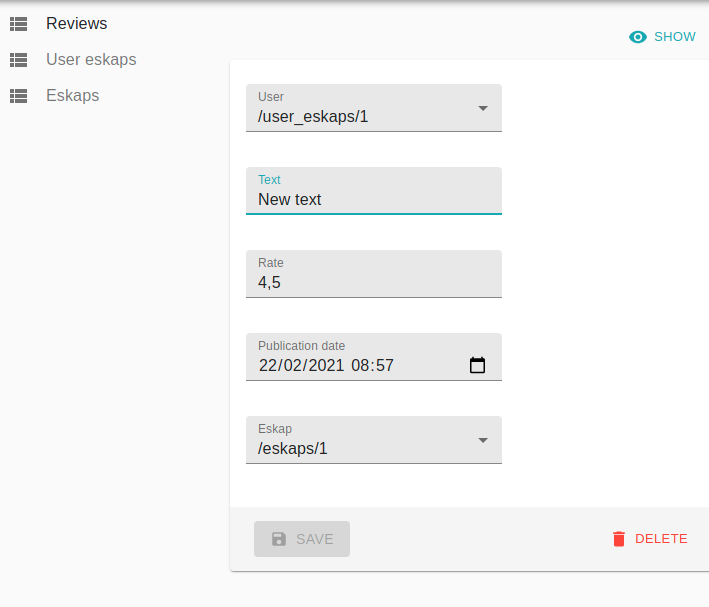
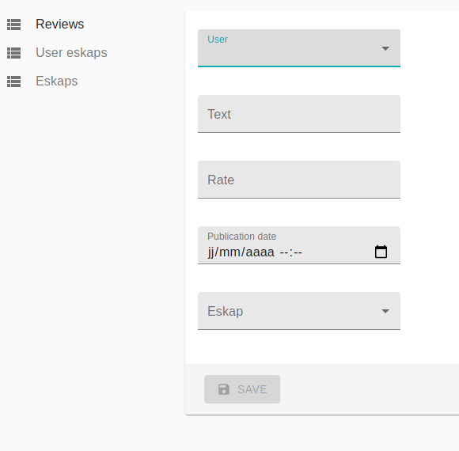

# Eskap API

Project of : Antoine Méresse & Imad Abdelmouine

## Entities

- Eskap : Entity for an Escape Game
- Review : Entity for a Review
- UserEskap : Entity for the users

# API

- url : `https://localhost/docs`

### Eskap

### Review

### UserEskap

# Admin

Backend for admins to manage datas (create, delete, read)

- url : `https://localhost/admin/`

## Eskap

## Review

## UserEskap

# Admin Manage Datas

From the admin area, we can manage datas. We'll see an example with reviews but it's also available for eskap and UserEskap.

## READ Datas (Review Example)

## Edit Datas (Review Example)

One of the problem we have, we can't edit entities from admin.
Save button isn't clickable.

From there, you can also delete the element.

## Create Datas (Review Example)

## API PLATFORM INFOS

If you want to check API platform : https://api-platform.com/
